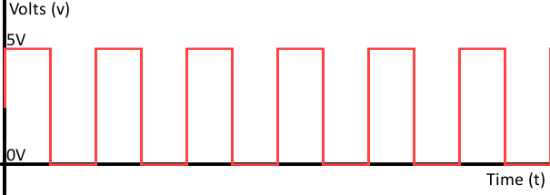

# GPIO Input - Light Sensor

For this module, we are going to measure how much light a photo resistor detects and how the Raspberry Pi can measure this.

## Digital Vs Analog

In electrical circuits there are two types of signals, digital and analog.  Analog signals are time-varying quantities, and in the case of electrical circuits that quantity is usually voltage or the "pressure". 

Digital signals on the other hand are only High or Low, 1 or 0 there is no in between.
If you graph a digital signal you tend to get a square wave like below.

## Resistance and Photoresistor
Let's talk about what resistance is in terms of electricity. Resistance is how easily the electricity can flow through a circuit.  Imagine two water tanks filled to the same level, one with a narrow pipe and one with a wide pipe.

It stands to reason that we can't fit as much volume through a narrow pipe than a wider one at the same pressure. This is resistance. The narrow pipe "resists" the flow of water through it even though the water is at the same pressure as the tank with the wider pipe.

The photoresistor changes the resistance of the circuit with how much light is shinning on it.  More light means a lower resistance while less light means a higher resistance.

## Raspberry Pi Reading Analog
A Raspberry Pi is a digital computer that only understands 1s and 0s, so how are we going to read an analog signal like we are going to get from the photoresistor? We are going to use a special microchip that will turn the analog signal into a digital one that the Raspberry Pi can read.  This is called an **A**nalog **D**igital **C**onverter (ADC). This microchip will look at the signal from the photoresistor and compare it to a base signal and assign it a number from 0 to 256 that the Raspberry Pi will read. 
## Experiment

Run the code `sudo photoresistor.py` and watch the number change as you move your hand over the photoresistor. 

Maybe have them switch out the photoresistor for the thermalresitor? Need to think of something for them to "change" to see results and "experiment with"
