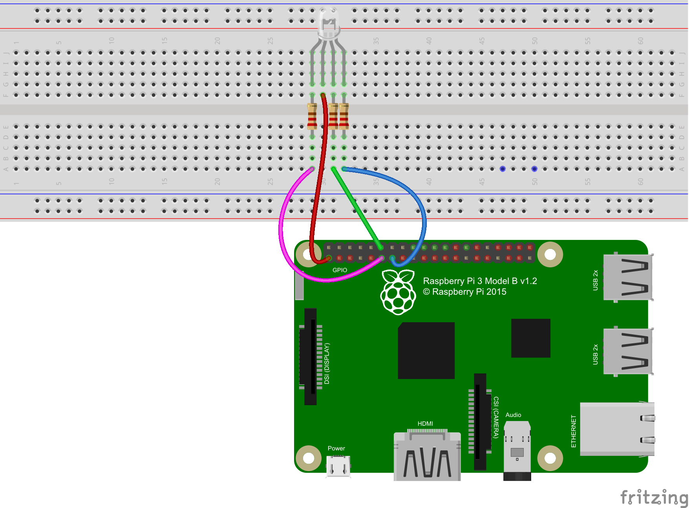

# GPIO Output - RGB LED

For this module, we are going to see how RGB LEDs are controlled and have some fun.

## What is an RGB LED

Let's start with what an RGB LED is.  An LED is a **L**ight **E**mitting **D**iode.  You might be asking "what is a diode?" Simply put a diode is like a one way street for electricity, allowing electricity to only flow in one direction.  The "RGB" portion tells us it is a **R**ed **G**reen **B**lue LED.  This means there are 3 different LEDs in one unit for each color.

## Pulse Width Modulation

With an LED we can not control its brightness the same way we do an incandescent bulb. Instead, what we do is turn the LED on and off very fast using something called **P**ulse **W**idth **M**odulation (PWM). We make the LED dimmer by increasing the time between it being on and off.

## Let's get Started

You should have a Raspberry Pi connected to what is called a breadboard with an RGB LED on it like the image below.

In the terminal run the following command `sudo rgbLed.py`

You should see the LED start to change colors.  Now press Ctrl+C to end the program.  Try changing the list of numbers on lines 6-12 from any number 0-100 and run the program again to see the effect. If you want you can add more colors by adding `[0, 0, 0],` Where indicated.
