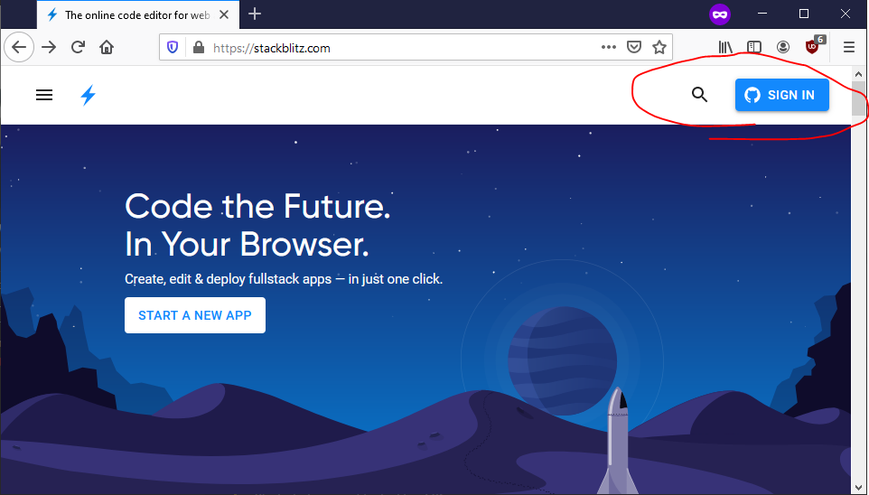
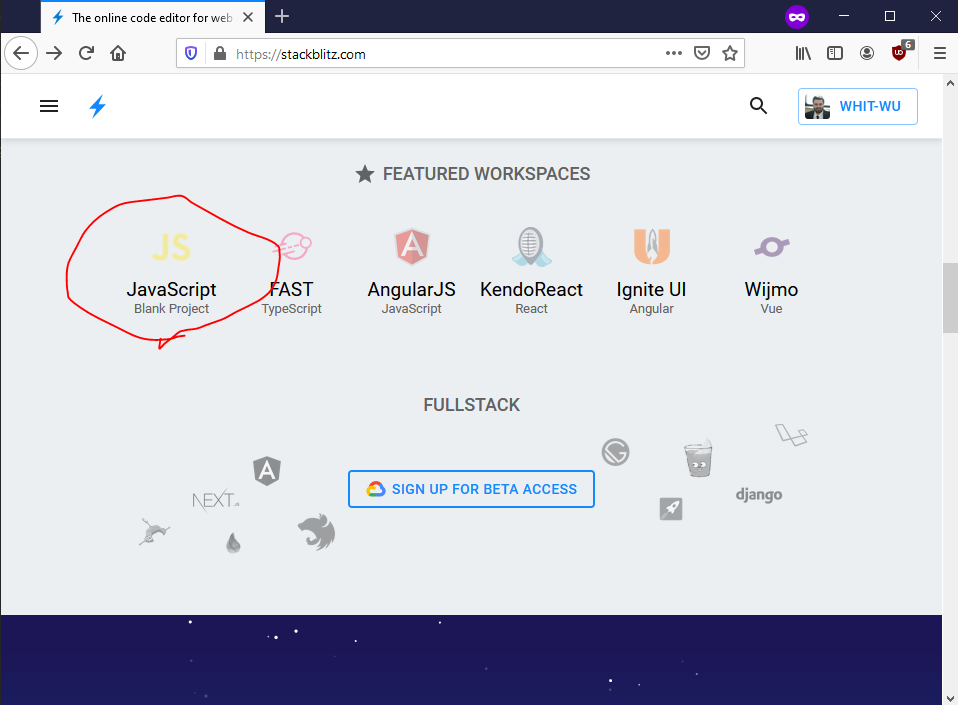
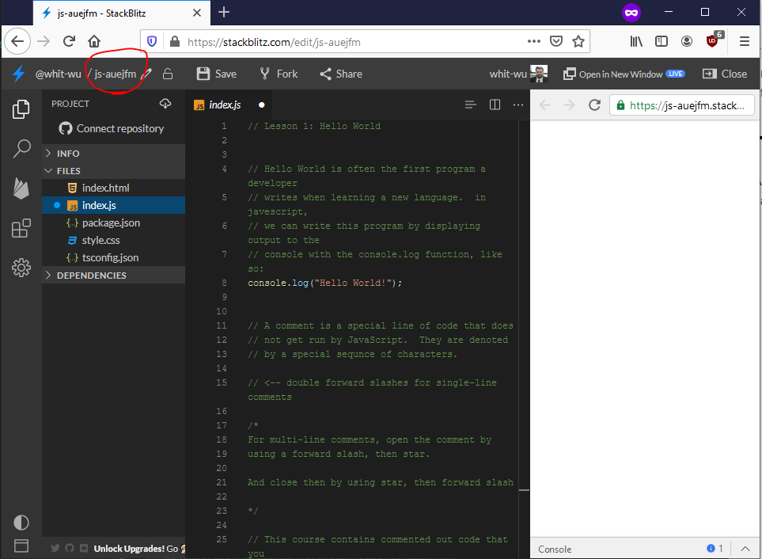
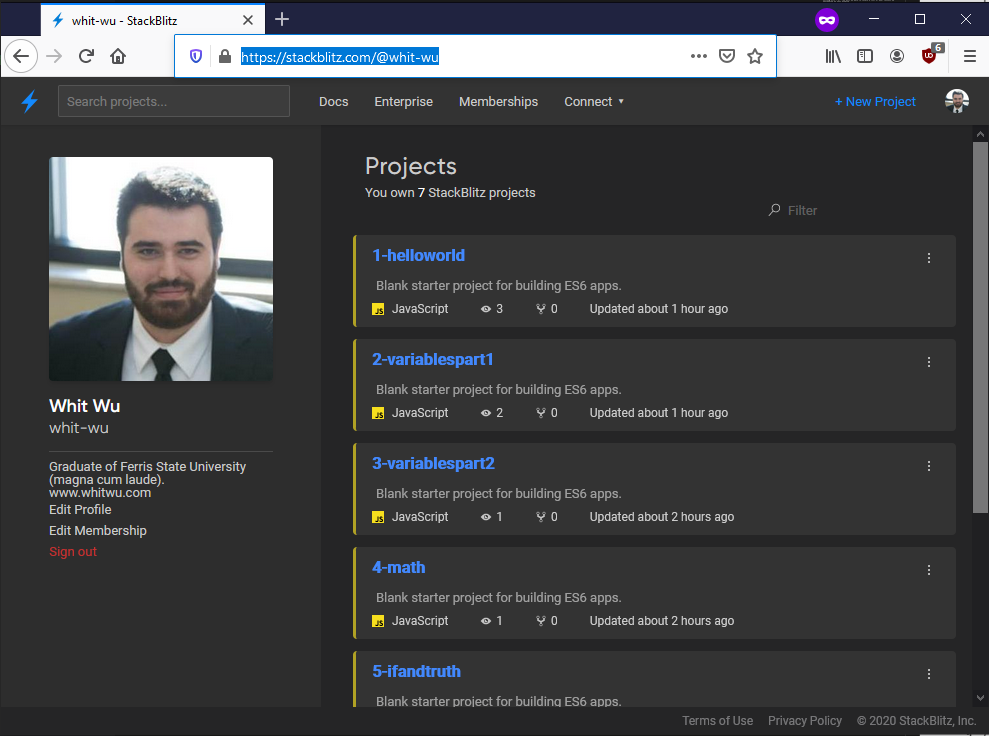
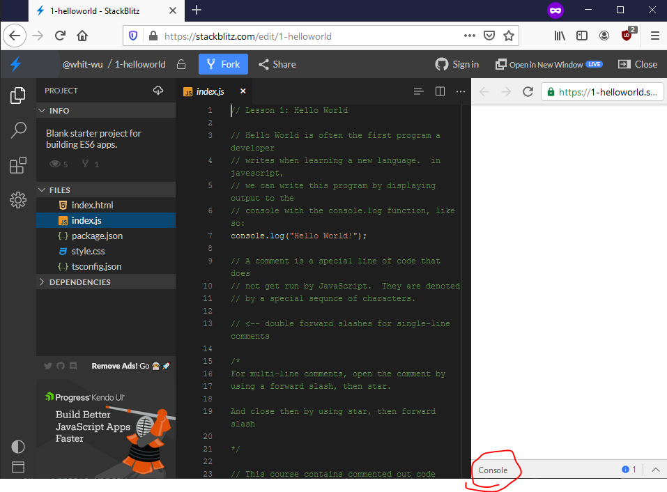
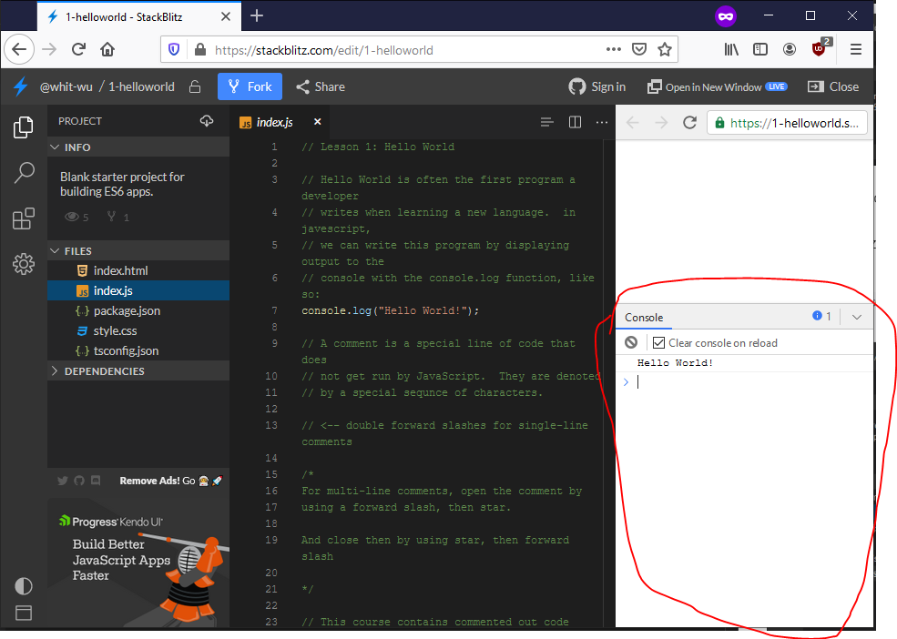
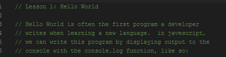
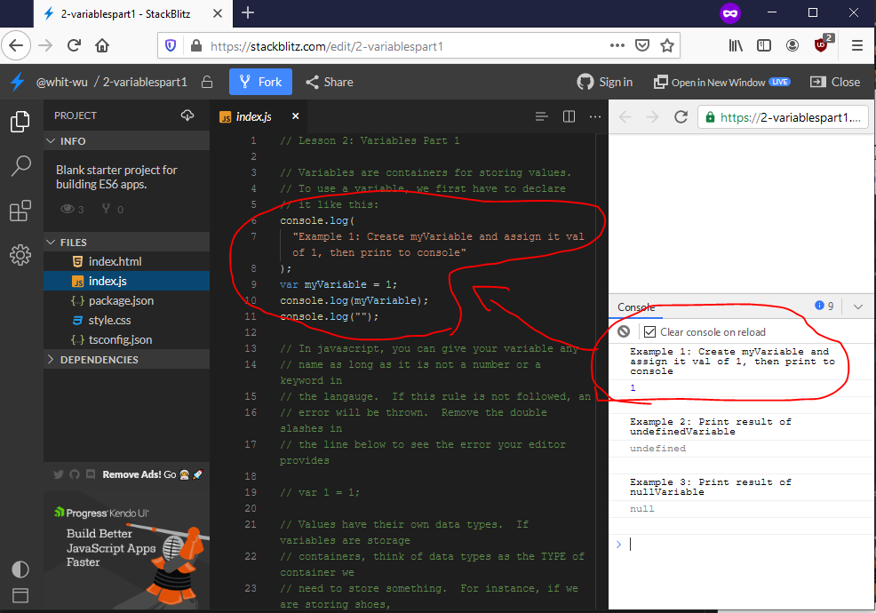
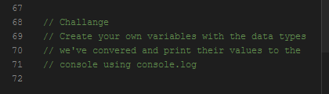
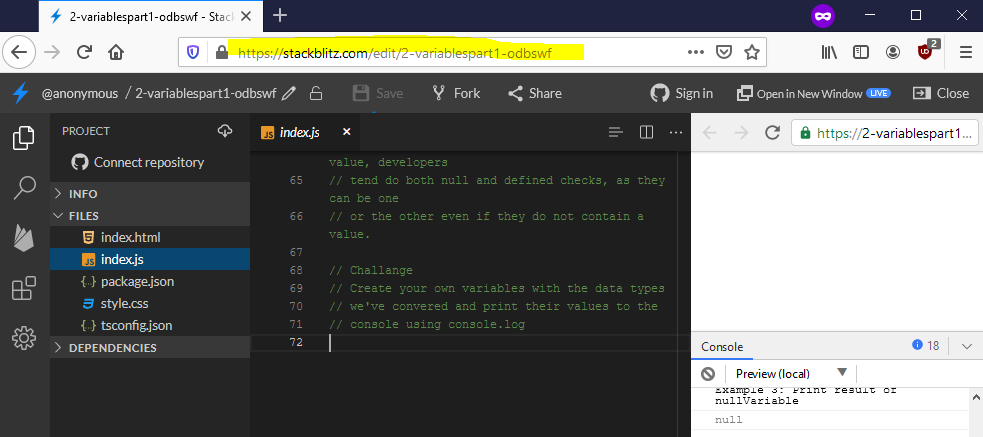

# Bravo LT Holiday Camp 2020

## Description
The Bravo LT Holiday Camp 2020 repo contains the source code used to teach the event of the same name.  All code is written in JavaScript, and teaches the following concepts:

- Variables
- Arithmetic
- Concatenation
- If/Switch statements
- Looping
- Objects
- Functions

This is meant to be a crash course in JavaScript that can be taught in under 2 hours.  The intention is to enable instructors to provide meaningful education to the students while allowing them to keep their attention.

## Hosting
At the time of this writing, the best hosting solution for these lessons is on StackBlitz.  To help simplify navigation, it was decided that each lesson be it's own project there.  To host a lesson on StackBlitz...
1. Navigate to www.stackblitz.com.
 
1. Sign into StackBlitz using your Github profile.  This can be done by clicking the sign-in button in the upper right corner of the home page.  Being signed into StackBlitz allows you to create a profile with the service, which you can share with your students.

 

3. Once signed in, you will be redirected to the homepage.  Scroll down to the "Featured Workspaces" section and select "JavaScript Blank Project"

 

4. Remove the contents of index.js, then copy the contents of a lesson and paste it there.  Once you have done that, click on the pencil to rename the project (preferably after the lesson you copied).  Ensure the changes are saved by hitting Ctrl + S.  You will be able to locate a list of your lessons by navigating to your profile.

 

5. Repeat steps 4 and 5 until all lessons have been copied.

## Using StackBlitz to Teach
1. Once your lessons are all saved, share the URL to your profile.  It will looks something like this: https://stackblitz.com/@GitHub_User_Name_Here.  Below, you can see how the lessons display in my profile...

 

You can also share the URL to each lesson

2. Use of the console is required when teaching this course.  Instruct your students to click on the console bar in each lesson so that it is replaced with a console window.  Please note that this window's size is adjustable.

Console Bar

Console Window

 

3. Lessons make use of code comments to explain theory, and can be read aloud if needed.

 

4. All code that is not commented out is executed upon opening the lesson.  Each example that outputs to the console with have "Example x" listed above it.  This is meant to help you easily find which example is tied to which section of code.

 

5. Each lesson contains a challenge for the students to accomplish that will help this put what they learned to practice.

It is expected that students will get stuck on these, especially if they are new to programming.  When this happens, have the student hit Ctrl + S to save their code.  StackBlitz will make a copy of the lesson with their changes and save that (the lessons tied to your profile will not be overwritten).  Once the copy is saved, have them share their lesson URL so that you can see their code and walk them through the problem.

